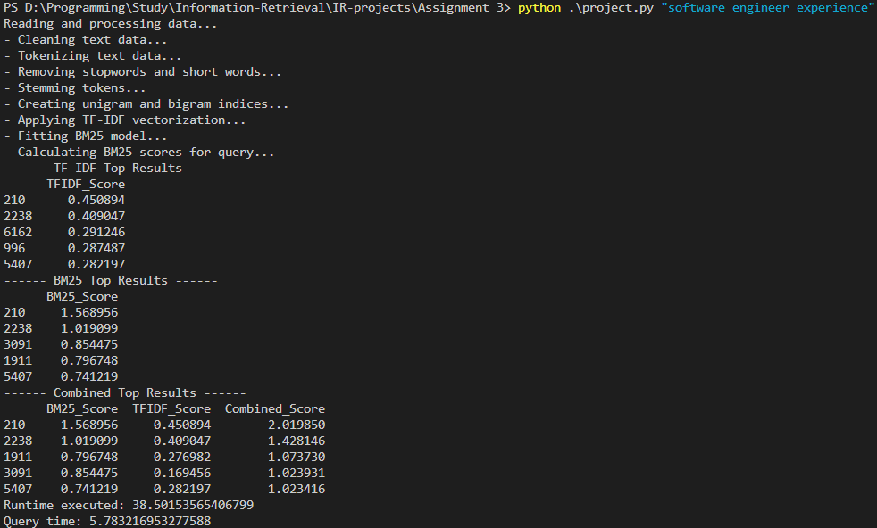
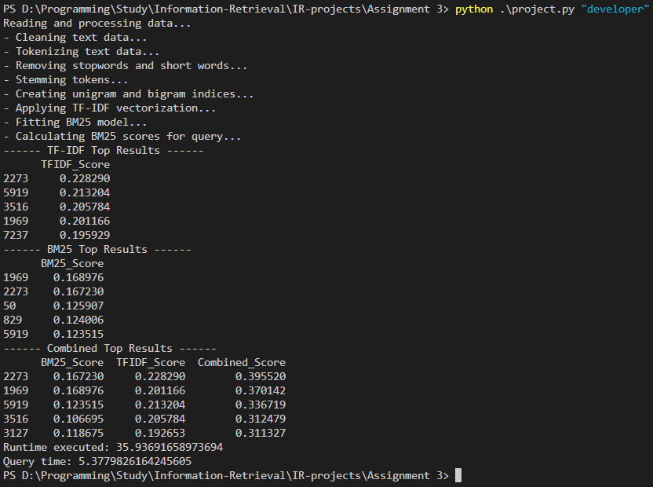

For q6
## **6. In-depth Analysis of BM25**
- **Example Query Where BM25 Performs Better**:
  - Provide an example query where BM25 gives better results.
    
    ```
    Query where BM25 may perform better:
    Example: "software engineer experience".
    - Longer query with terms likely to appear in documents of varying lengths.
    ```
    

  - Explain why BM25 performed better in this case (e.g., considering term frequency saturation, document length normalization).
    <b>
    > ### BM25 performed better because :
    > - It handles term frequency saturation, emphasizing relevance over excessive repetition.
    > - It normalizes scores for document length, ensuring fair comparison between documents of varying sizes.
    </b>
- **Example Query Where BM25 Performs Worse**:
  - Provide an example query where BM25 gives worse results.
    ```
    Query where TF-IDF may perform better:
    Example: "developer".
    - Short query with high-frequency terms across documents.
    ```
    
  - Explain why BM25 performed worse in this case (e.g., due to short query terms or overly normalized results).
    > Why BM25 performed worse:
    > - The query "developer" is a short, high-frequency term, leading to excessive normalization of term frequency in longer documents.
    > - BM25's document length normalization can reduce the impact of the term’s frequency in relevant documents, especially for shorter queries with common terms.